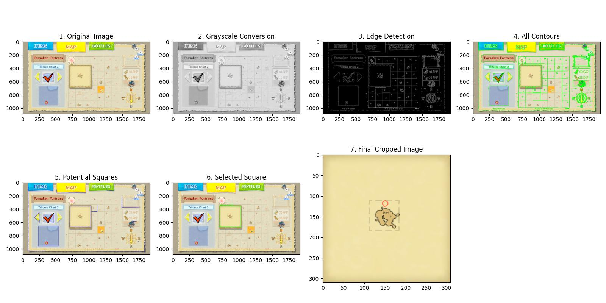
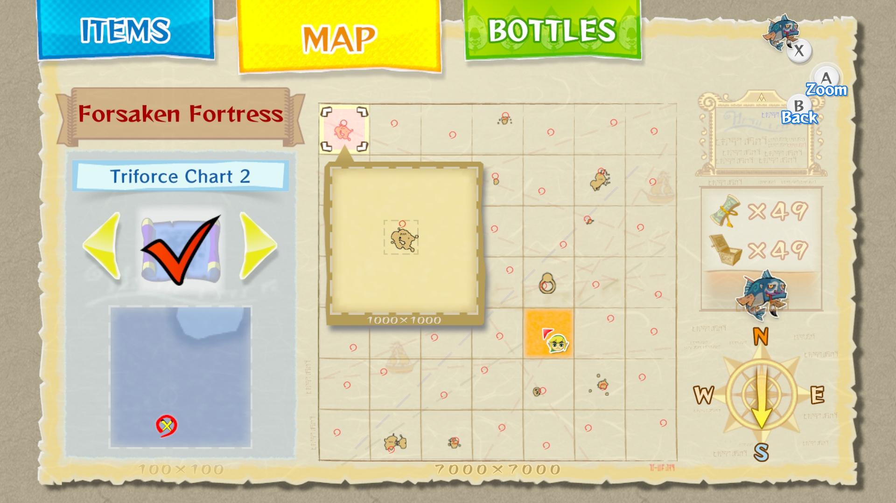
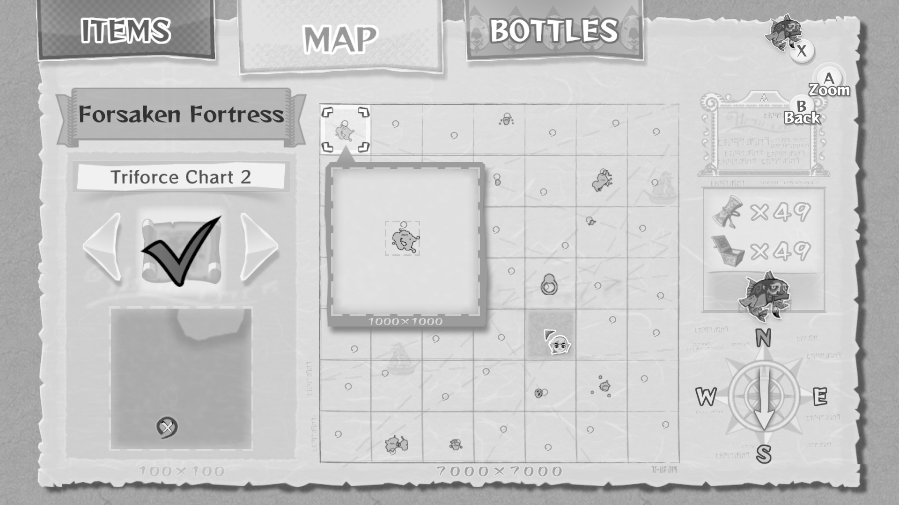
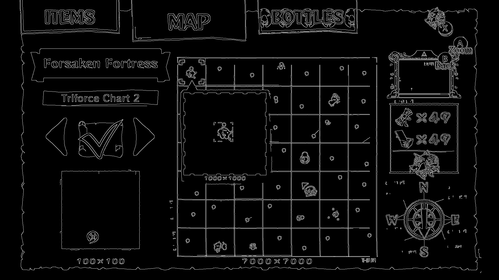
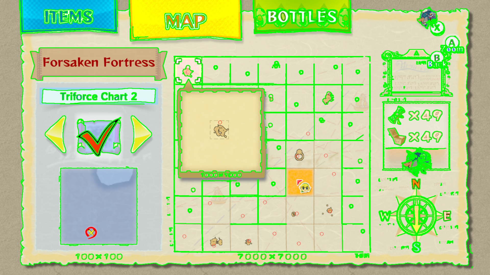
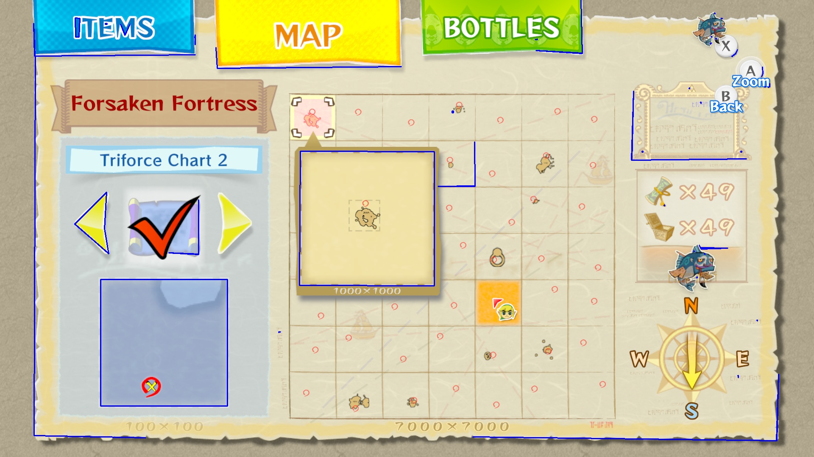
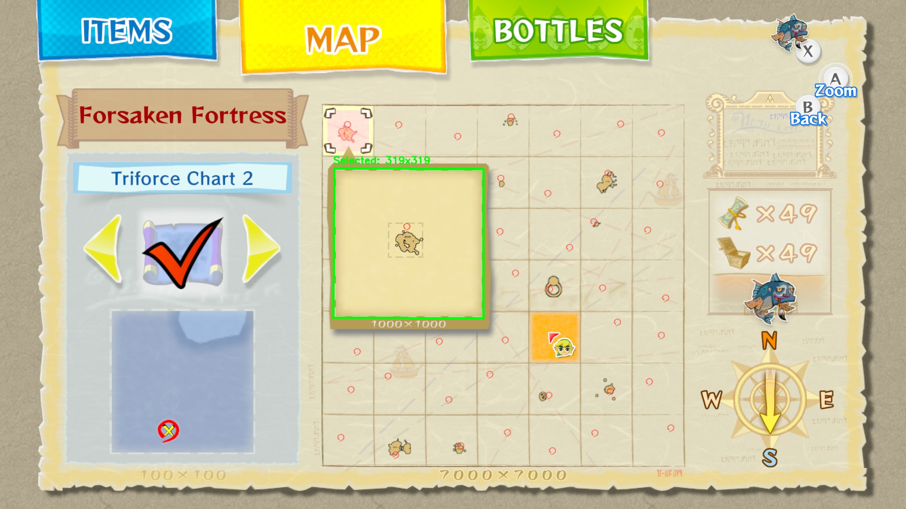
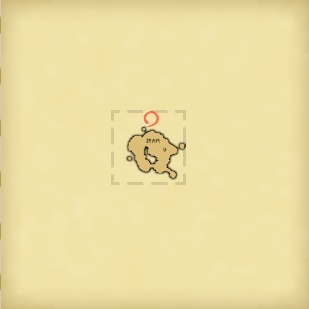

## Preface

This project marks my first experience with OpenCV for targeted image detection. The process proved both educational and rewarding, prompting me to document my approach for future reference and to help others exploring computer vision techniques.

I developed this script to extract assets from Wind Waker HD screenshots for the [Wind Waker Tracker app's](https://github.com/CaptainChrispy/wind-waker-tracker) interactive map feature. After encountering challenges with direct game asset extraction due to UI rendering methods, I opted to work with game screenshots instead. Rather than manually cropping of images, I utilized OpenCV to automate the process. This project demonstrates how to detect and extract the dotted minimap squares from Wind Waker HD's map interface for use in external applications.

## Table of Contents

- [Complete Processing Pipeline](#complete-processing-pipeline)
- [1. Image Loading and Preprocessing](#1-image-loading-and-preprocessing)
- [2. Edge Detection](#2-edge-detection)
- [3. Contour Detection](#3-contour-detection)
- [4. Finding the Most Square-Like Polygon](#4-finding-the-most-square-like-polygon)
- [5. Filtering by Shape and Size](#5-filtering-by-shape-and-size)
- [6. Cropping and Saving the Image](#6-cropping-and-saving-the-image)

## Complete Processing Pipeline



## 1. Image Loading and Preprocessing
```python
image = cv2.imread(image_path)
gray = cv2.cvtColor(image, cv2.COLOR_BGR2GRAY) # Convert to grayscale for easier processing
```




When loading the image, I convert it to grayscale using OpenCV's [cvtColor transformation](https://docs.opencv.org/4.x/de/d25/imgproc_color_conversions.html). This simplifies the image by reducing it from a 3-channel color image to a single-channel intensity image. Grayscale conversion is beneficial because it:
- Reduces memory usage and computational complexity
- Simplifies edge detection by focusing on intensity changes rather than color changes
- Is often sufficient for shape detection tasks where color isn't important, such as this one

## 2. Edge Detection
```python
edges = cv2.Canny(gray, 50, 150) # Apply edge detection to find dotted border
```



Next, I apply [Canny edge detection](https://docs.opencv.org/4.x/da/d22/tutorial_py_canny.html), a multi-stage algorithm for detecting edges in images. It essentially works by taking the grayscale image and identifying areas with sharp transitions in pixel brightness, which correspond to edges.

The two threshold values control the sensitivity - the lower threshold (50) connects edges, while the upper threshold (150) identifies strong edges. This combination helps detect the dotted border while rejecting noise.

## 3. Contour Detection
```python
# Find contours from edges
contours, _ = cv2.findContours(edges, cv2.RETR_EXTERNAL, cv2.CHAIN_APPROX_SIMPLE)
```



After edge detection, I use OpenCV's [contour finding function](https://docs.opencv.org/4.x/d4/d73/tutorial_py_contours_begin.html) to identify the boundaries of shapes in the image. 

The key parameters in our implementation are:
- `cv2.RETR_EXTERNAL`: Retrieves only the outermost contours and ignores any nested contours.
- `cv2.CHAIN_APPROX_SIMPLE`: A compression method that stores only the endpoints of horizontal, vertical, and diagonal segments, significantly reducing memory usage without losing important shape information.

The Wind Waker HD's dotted border around the island forms a relatively clean contour after edge detection, making it ideal for this approach.

## 4. Finding the Most Square-Like Polygon
```python
# Look for the most square-like, medium-sized polygon
best_square = None
best_area = 0

for cnt in contours:
    approx = cv2.approxPolyDP(cnt, 0.02 * cv2.arcLength(cnt, True), True)
    if len(approx) == 4:
        x, y, w, h = cv2.boundingRect(approx)
        aspect_ratio = w / float(h)
        area = w * h
```



To identify our target, I use the [Douglas-Peucker algorithm](https://docs.opencv.org/4.x/dd/d49/tutorial_py_contour_features.html) (implemented via `cv2.approxPolyDP`), which simplifies contours by reducing the number of points while preserving the essential shape. The epsilon parameter (`0.02 * cv2.arcLength(cnt, True)`) controls the approximation accuracy - smaller values result in more detailed approximations.

## 5. Filtering by Shape and Size
```python
# Check for square shape and that its within expected area range
if 0.9 < aspect_ratio < 1.1 and 300 < w < 330 and 300 < h < 330:
    if area > best_area:
        best_area = area
        best_square = (x, y, w, h)
```



This heuristic approach combines three criteria to identify our target square:

1. **Aspect ratio filtering** (0.9 < w/h < 1.1): Ensures the shape is approximately square, allowing for a 10% deviation from perfect 1:1 ratio to accommodate imperfect contour detection.

2. **Size constraints** (300-330 pixels): These values were determined by analyzing multiple Wind Waker HD screenshots. The consistency of the UI elements across the game makes this range reliable.

3. **Largest area selection**: When multiple candidates meet the criteria, we select the largest one

This multi-criteria approach creates a robust detection system that can handle variations in screenshots while maintaining precision.

## 6. Cropping and Saving the Image
```python
if best_square:
    x, y, w, h = best_square
    # Slight cropping to remove border
    padding = 5
    cropped = image[y + padding:y + h - padding, x + padding:x + w - padding]
    cv2.imwrite(output_path, cropped)
    print(f'Cropped and saved to {output_path}')
```



The final step uses Python's array slicing to crop the image and account for some padding to remove the dotted border around the map piece. The cropped image is then saved to the specified output path using OpenCV's `imwrite` function.

## Conclusion

This project demonstrates how combining relatively simple computer vision techniques can create a specialized tool for game screenshot processing. While this implementation is tailored for Wind Waker HD screenshots, the same principles can be applied to other applications by focusing on the specific characteristics of the target images.